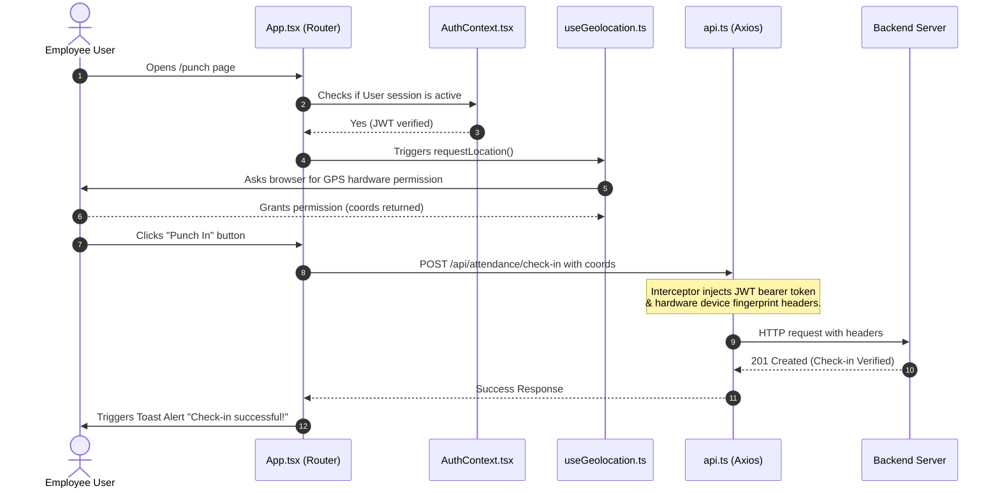

# 🧠 Group 2 Master Study Guide: Frontend State, Hooks & Client-Side Logic
## 🛡️ GeoShield AI — Smart Geofenced Workforce Telemetry

Welcome to your study guide! As a member of **Group 2**, you are responsible for the **nervous system, the GPS navigator, the smart key ignition, and the dashboard alerts** of the GeoShield AI application. 

---

## 🚗 Layman's Analogy: "How Group 2 Controls the Car"

To understand what you are building, think of the entire full-stack application as a high-tech smart car:
*   **Group 1 (UI/UX)** designs the look of the car—the paint, the beautiful leather seats, the dashboard screens, and the wheels.
*   **Group 3 (Backend API)** is the mechanical engine under the hood that does all the heavy calculations.
*   **Group 4 (Database & Security)** is the secure gas tank and anti-theft database lock.
*   **YOUR TEAM (Group 2)** is the smart electronics system inside the dashboard:

```
┌────────────────────────────────────────────────────────┐
│                   GROUP 2: ELECTRONICS                 │
├────────────────────────────────────────────────────────┤
│  🛰️ GPS Tracker   👉 "Where is the car?" (Geolocation) │
│  🔑 Smart Key     👉 "Who is driving?" (Auth Context)  │
│  🚨 Warning lights 👉 "Beep! Success/Error" (Toasts)  │
│  👮 Security Guard 👉 "Authorized area?" (Route Guard) │
└────────────────────────────────────────────────────────┘
```

1.  **🛰️ The GPS Navigator ([useGeolocation.ts](file:///c:/Users/shahi/OneDrive/Documents/GitHub/mml/frontend/src/hooks/useGeolocation.ts)):** Before the car lets you do anything, it needs to know exactly where you are standing. Our custom hook asks your phone or computer's GPS hardware: *"Give us your exact latitude and longitude down to the nearest meter."* If you are outside the boundary circle, we lock the screen.
2.  **🔑 The Smart Key System ([AuthContext.tsx](file:///c:/Users/shahi/OneDrive/Documents/GitHub/mml/frontend/src/context/AuthContext.tsx)):** This remembers if you are logged in. When you log in, we issue you a digital keycard (called a **JWT Token**). We store it in your browser’s pocket (Local Storage) so you don’t have to type your password again if you refresh the browser page.
3.  **📡 The Secure Transmission Line ([api.ts](file:///c:/Users/shahi/OneDrive/Documents/GitHub/mml/frontend/src/services/api.ts)):** Whenever the car talks to the engine (the backend), our interceptor automatically attaches your digital keycard (JWT) and your unique device fingerprint to the request. If the security engine says *"This key is expired!"*, we immediately shut off the ignition and bounce you back to the `/login` screen.
4.  **🚨 The Dashboard Alert Box ([ToastContext.tsx](file:///c:/Users/shahi/OneDrive/Documents/GitHub/mml/frontend/src/context/ToastContext.tsx)):** Whenever a check-in succeeds or fails, we trigger a glowing popup in the corner of the screen that slides in, drains a timer line, and fades away automatically.
5.  **👮 The Security Gates ([App.tsx](file:///c:/Users/shahi/OneDrive/Documents/GitHub/mml/frontend/src/App.tsx)):** If an employee attempts to sneak into the administrator's dashboard by typing `/admin` in the URL, our route guard intercepts them, slams the gate shut, and redirects them to the `/employee` workspace.

---

## 🛠️ Technical Deep-Dive & Architecture

Let's break down the 4 pillars of your role from a software engineering perspective.



---

### 1. 🛰️ Geolocation Telemetry: [useGeolocation.ts](file:///c:/Users/shahi/OneDrive/Documents/GitHub/mml/frontend/src/hooks/useGeolocation.ts)

This hook abstracts the HTML5 Geolocation API, providing safe error handling and loading indicators to the punching UI.

```typescript
const options: PositionOptions = {
  enableHighAccuracy: true, // Force GPS hardware instead of coarse IP/Cell tower estimation
  timeout: 10000,          // Abort if hardware takes longer than 10 seconds to lock
  maximumAge: 0,           // Force fresh GPS reading; do not serve cached coordinates
};
```

#### 💡 Key Technical Details:
*   **`useCallback` Wrap:** The `requestLocation` function is wrapped in `useCallback` to prevent unnecessary component re-renders.
*   **Promise Wrapper:** Since the browser's `navigator.geolocation.getCurrentPosition` uses old-school callback patterns, we wrap it in a modern ES6 Promise so that components can simply `await requestLocation()`.
*   **Error States:** Handles common device permission denials (`PERMISSION_DENIED`), hardware GPS lock-failures (`POSITION_UNAVAILABLE`), and signal timeouts (`TIMEOUT`).

---

### 2. 🔑 Session State Management: [AuthContext.tsx](file:///c:/Users/shahi/OneDrive/Documents/GitHub/mml/frontend/src/context/AuthContext.tsx)

This Context serves as the global store for user states, ensuring components do not lose credentials upon browser reloads.

```typescript
// Hook hookup to expose context variables
export const useAuth = (): AuthContextType => {
  const context = useContext(AuthContext);
  if (context === undefined) {
    throw new Error('useAuth must be used inside an AuthProvider');
  }
  return context;
};
```

#### 💡 Key Technical Details:
*   **Session Restoration Lifecycle:** On mounting, a `useEffect` checks the browser's `localStorage` for `geoshield_token`. If present, it fires a `/auth/me` call to the server to verify JWT signature freshness.
*   **Global Authentication Provider:** The `AuthProvider` wraps the entire app root in [App.tsx](file:///c:/Users/shahi/OneDrive/Documents/GitHub/mml/frontend/src/App.tsx), making variables like `user`, `token`, and `loading` accessible in every nested component via the `useAuth` custom React hook.

---

### 📡 The Communication Layer: [api.ts](file:///c:/Users/shahi/OneDrive/Documents/GitHub/mml/frontend/src/services/api.ts)

This configuration serves as the centralized HTTP client, configuring headers and globally handling authorization anomalies.

```typescript
// 1. Request Interceptor: Automatically inject credentials
api.interceptors.request.use((config) => {
  const token = localStorage.getItem('geoshield_token');
  if (token) {
    config.headers.Authorization = `Bearer ${token}`; // Append stateless JWT badge
  }
  config.headers['X-Device-Fingerprint'] = getDeviceFingerprint(); // Device Anti-Fraud tracking
  config.headers['X-Device-Name'] = getDeviceName();
  return config;
});

// 2. Response Interceptor: Catch auth violations globally
api.interceptors.response.use(
  (response) => response,
  (error) => {
    if (error.response && error.response.status === 401) {
      localStorage.removeItem('geoshield_token'); // Purge token
      localStorage.removeItem('geoshield_user');
      window.location.href = '/login';           // Force kick out to login page
    }
    return Promise.reject(error);
  }
);
```

#### 💡 Key Technical Details:
*   **Bearer Injector:** The Request Interceptor intercepts every outbound Axios request, checks if a token exists in `localStorage`, and appends the standard HTTP `Authorization: Bearer <token>` header dynamically.
*   **Device Fingerprinting Headers:** It injects unique, non-invasive client fingerprints `X-Device-Fingerprint` and `X-Device-Name` derived from browser specs. The backend uses this to enforce **device binding** (students cannot punch on behalf of others).
*   **401 Global Interception:** The Response Interceptor catches all responses with status `401 Unauthorized` (indicating the token expired or was modified). It automatically flushes local storage cache and redirects the user to `/login`.

---

### 3. 🚨 The Alert Engine: [ToastContext.tsx](file:///c:/Users/shahi/OneDrive/Documents/GitHub/mml/frontend/src/context/ToastContext.tsx)

This provides sliding, dynamic banner alerts inside a React portal using Framer Motion animations.

```typescript
// Dynamic progress bar animation with a 4s drain time
<motion.div 
  initial={{ width: '100%' }}
  animate={{ width: '0%' }}
  transition={{ duration: 4, ease: 'linear' }}
  className="absolute bottom-0 left-0 h-1 bg-emerald-500"
/>
```

#### 💡 Key Technical Details:
*   **AnimatePresence Layout:** Utilizing Framer Motion’s `<AnimatePresence>` to coordinate exit animations when toast queues are popped.
*   **Unique Math Keys:** Every toast gets a dynamically calculated 7-character base36 ID `Math.random().toString(36).substring(2, 9)` to ensure individual mounting controls.
*   **Auto-Dismiss Timers:** Sets a non-blocking `setTimeout` that automatically removes toasts from state array 4 seconds after creation, visually represented by an animating linear color bar draining at the bottom of the card.

---

### 4. 👮 Routing Access Protection Guards: [App.tsx](file:///c:/Users/shahi/OneDrive/Documents/GitHub/mml/frontend/src/App.tsx)

Your router maps public views, protected student workspaces, and secure admin layouts through custom route wrappers.

```typescript
const ProtectedRoute: React.FC<{ children: React.ReactNode; allowedRole?: 'admin' | 'employee' }> = ({
  children,
  allowedRole,
}) => {
  const { user, loading } = useAuth();

  if (loading) return <LoadingSpinner />; // Prevent flicker while validating token
  if (!user) return <Navigate to="/login" replace />; // Redirect unauthorized users
  if (allowedRole && user.role !== allowedRole) {
    // Role mismatch? Redirect to their allowed dashboard
    return <Navigate to={user.role === 'admin' ? '/admin' : '/employee'} replace />;
  }
  return <>{children}</>;
};
```

#### 💡 Key Technical Details:
*   **Role-Based Security (RBAC):** Binds pages (like dashboard or punch verification) to specific roles. If an employee accesses `/admin`, the guard blocks rendering and navigates them safely to `/employee`.
*   **Loading State Interception:** The guard reads `loading` from [AuthContext.tsx](file:///c:/Users/shahi/OneDrive/Documents/GitHub/mml/frontend/src/context/AuthContext.tsx) to prevent page flickering while verifying local tokens on startup.

---

## 🎯 Group 2 Study Verification Check

To master your role, ensure you can write out these solutions in code:
1.  **Question:** *What happens if a user disables their browser's location settings?*
    *   **Answer:** [useGeolocation.ts](file:///c:/Users/shahi/OneDrive/Documents/GitHub/mml/frontend/src/hooks/useGeolocation.ts) catches error code `err.PERMISSION_DENIED` and sets `error` to `"Location access denied. Please enable location permissions in your browser..."` which triggers a visual red alert.
2.  **Question:** *How are we protecting against students passing their credentials to a friend to check in for them?*
    *   **Answer:** [api.ts](file:///c:/Users/shahi/OneDrive/Documents/GitHub/mml/frontend/src/services/api.ts) injects the device fingerprint inside headers. The backend compares this fingerprint with the trusted device profile. Mismatches trigger a security flag or rejection.
3.  **Question:** *Where is the best place to call `showToast` during a check-in lifecycle?*
    *   **Answer:** In the event handler inside [PunchPage.tsx](file:///c:/Users/shahi/OneDrive/Documents/GitHub/mml/frontend/src/pages/PunchPage.tsx), wrapped inside `try-catch`:
        ```typescript
        try {
          const coords = await requestLocation();
          await api.post('/attendance/check-in', coords);
          showToast('Check-in successful! Welcome back.', 'success');
        } catch (err: any) {
          showToast(err.message || 'Check-in failed.', 'error');
        }
        ```
