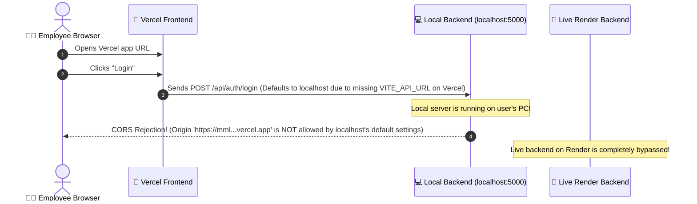

# 📐 CORS & Production API Routing Resolution Plan
## 🔍 Executive Root-Cause Analysis

Your Vercel-deployed frontend is encountering a critical blocker when attempting to log in. The browser console displays two specific errors:
1. **CORS Preflight Block:** `Access to XMLHttpRequest at 'http://localhost:5000/api/auth/login' from origin 'https://mml-rl0tkieo6-shahid5027s-projects.vercel.app' has been blocked by CORS policy...`
2. **Network Connection Failure:** `Failed to load resource: net::ERR_FAILED` (targeting `localhost:5000`).

---

### 🌐 The Architecture Mismatch Flow

The diagram below illustrates the incorrect request path causing the failures:



There are **two underlying mismatches** causing this lifecycle failure:

#### Mismatch 1: Incorrect API Endpoint Fallback
Because Vercel was deployed without the `VITE_API_URL` environment variable, the Axios HTTP client in [api.ts](file:///c:/Users/shahi/OneDrive/Documents/GitHub/mml/frontend/src/services/api.ts#L3) automatically fell back to its default value:
```typescript
const API_URL = (import.meta as any).env.VITE_API_URL || 'http://localhost:5000/api';
```
As a result, your production frontend running on Vercel tried to send requests directly to `http://localhost:5000` (which is your local development computer). 

#### Mismatch 2: Local CORS Security Boundary
When the request reached your local Express server running on your computer, the CORS middleware in [server.ts](file:///c:/Users/shahi/OneDrive/Documents/GitHub/mml/backend/src/server.ts#L11-L18) intercepted it:
```typescript
app.use(
  cors({
    origin: process.env.CLIENT_URL || 'http://localhost:5173',
...
```
Since the request came from your live Vercel domain (`https://mml-...vercel.app`) but the local server's CORS configuration only allows `http://localhost:5173` (by default), the local server rightfully slammed the gate shut, throwing the CORS policy preflight block!

---

## 🛠️ Premium Engineering Solution

To resolve this permanently and make your deployment extremely robust, we will implement a two-pronged solution:

### 1️⃣ Dynamic Intelligent CORS Shield (Backend)
Instead of restricting the backend to a single hardcoded origin, we will upgrade the CORS handler in the backend [server.ts](file:///c:/Users/shahi/OneDrive/Documents/GitHub/mml/backend/src/server.ts) to:
* Automatically trust local development endpoints (`localhost:*`).
* Safely whitelist any of your Vercel deployment domains (`*.vercel.app`) dynamically using regex patterns.
* Allow explicit fallback to the configured `CLIENT_URL` environment variable.

### 2️⃣ Correct Environment Configuration (Cloud Portals)
Ensure that Vercel is explicitly configured to communicate with the Render API, and Render is configured to whitelist the Vercel front-end origin.

---

## 📋 Step-by-Step Implementation Guide

```
┌────────────────────────────────────────────────────────┐
│                   IMPLEMENTATION STEPS                 │
├────────────────────────────────────────────────────────┤
│ 1. Upgrade server.ts CORS with Dynamic Whitelist      │
│ 2. Test Backend Compile & Commit to GitHub            │
│ 3. Add VITE_API_URL in Vercel Portal                  │
│ 4. Add CLIENT_URL in Render Portal                    │
└────────────────────────────────────────────────────────┘
```

### Step 1: Upgrading Backend CORS Setup
We will update [server.ts](file:///c:/Users/shahi/OneDrive/Documents/GitHub/mml/backend/src/server.ts) with a professional-grade dynamic CORS validation function.

### Step 2: Configure Environment Variables in Cloud Portals

#### 🎨 A. On Vercel Portal (Frontend Settings)
1. Go to your project dashboard on Vercel.
2. Navigate to **Settings > Environment Variables**.
3. Create a new variable:
   * **Key:** `VITE_API_URL`
   * **Value:** `https://geoshield-api.onrender.com/api` *(Replace this with your actual Render web-service URL ending with `/api`)*
4. Click **Save**.
5. Navigate to **Deployments**, click the three dots on your latest deployment, and select **Redeploy** to apply the new variable!

#### 🚀 B. On Render Portal (Backend Settings)
1. Go to your Render Dashboard.
2. Select your Express Web Service.
3. Navigate to the **Environment** tab.
4. Add or update the following variable:
   * **Key:** `CLIENT_URL`
   * **Value:** `https://mml-rl0tkieo6-shahid5027s-projects.vercel.app` *(Your current active Vercel domain)*
5. Click **Save Changes**. Render will automatically redeploy your API.

---

## ✅ Post-Deployment Verification Checklist

Once the steps are complete, you can verify your integration using these tests:

| Check | Expected Result | Action on Failure |
| :--- | :--- | :--- |
| **Backend Health** | Accessing `https://your-render-url.onrender.com/health` returns `{"status":"ok"}` | Check Render runtime logs for startup crashes or missing `.env` config. |
| **Frontend Endpoint** | Open browser DevTools (F12) ➡️ Network Tab. Perform a login action. Request should post to `your-render-url.onrender.com` | Verify `VITE_API_URL` is set correctly in Vercel and that you did a **Redeploy**. |
| **CORS Handshake** | Request header `Origin` matches Response header `Access-Control-Allow-Origin` | Ensure `CLIENT_URL` matches the exact protocol and host of your Vercel deployment. |
